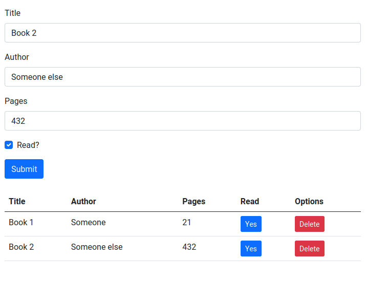

# Library App

> Small Library app for recording a collection of books.

 - Has a form to add a book.
 - Shows books saved.
 - Has a button to remove a book.
 - Has a button to change the read status.

## Built With

- Html, CSS, and JavaScript
- Bootstrap

## Live Demo

[Live Demo Link](https://jpdf00.github.io/library-app/)

## Getting Started

**This is an example of how you may give instructions on setting up your project locally.**
**Modify this file to match your project, remove sections that don't apply. For example: delete the testing section if the currect project doesn't require testing.**

To get a local copy up and running follow these simple example steps.

### Prerequisites

### Setup

### Install

### Usage

### Run tests

### Deployment

## Authors

👤 **Author1**

- GitHub: [@githubhandle](https://github.com/githubhandle)
- Twitter: [@twitterhandle](https://twitter.com/twitterhandle)
- LinkedIn: [LinkedIn](https://linkedin.com/linkedinhandle)

👤 **João Paulo Dias França**

- GitHub: [@jpdf00](https://github.com/jpdf00)
- Twitter: [@jpdf00](https://twitter.com/jpdf00)
- LinkedIn: [João Paulo Dias França](https://www.linkedin.com/in/jpdf00/)

## 🤝 Contributing

Contributions, issues, and feature requests are welcome!

Feel free to check the [issues page](https://github.com/jpdf00/library-app/issues).

## Show your support

Give a ⭐️ if you like this project!

## Acknowledgments

- Hat tip to anyone whose code was used
- Inspiration
- etc

## 📝 License

This project is [MIT](./LICENSE) licensed.
